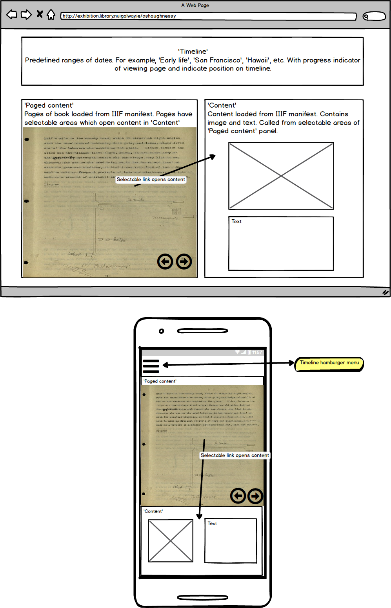
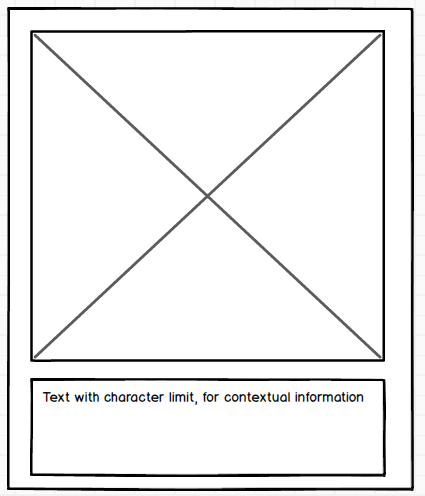
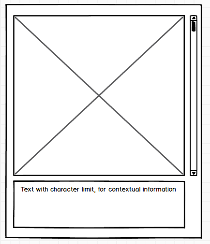

# nui-galway-viewer
Timeline viewer for National University of Ireland, Galway

## Scenario 
A primary item of content that has clear temporal coverage, in this case a memoir, that links to other content.

## Background to the material

Michael Maurice O’Shaughnessy (MMOS) began his engineering studies at Queen’s College, Cork. After a year in Cork, he transferred to Queen’s College, Galway to study Civil Engineering under Professor Townsend, and in 1884 he was awarded his degree by the Royal University of Ireland. The following year O’Shaughnessy travelled to the United States. Following several decades of engineering experience in the US and in Hawaii, he was invited to become chief engineer of San Francisco by the mayor of the city in 1912, a position he served in for over 20 years.

The appointment came soon after the great earthquake of 1906 which had destroyed 80% of the city of San Francisco. O’Shaughnessy oversaw several major developments during a period of tremendous growth for the city, notably the design and execution of the Hetch Hetchy scheme which supplied water to the growing city.

Our collection contains a wealth of material relating to O’Shaughnessy’s time in private practice. Correspondence covering his mining interests, rail projects, and irrigation work on the sugar plantations in Hawaii are complemented by photographs, detailed drawings and blueprints that build up a substantial picture of these projects.

The archive includes over 2,200 photographs depicting site work, professional gatherings, and of his personal family life.

## Objectives

The objective of this assignment is to provide code and documentation to enable viewing and timeline based navigation of the MMOS memoir, (175 A4 single pages), with a suitably customised IIIF viewer.

The solution will utilise 3 panels: (pic below) – a top panel contains the navigational timeline, the left panel contains the viewer and a right panel contains the supplemental content. The navigational timeline is synchronised with the viewer in that it advances and retreats as the user navigates the document. A timeline-controller or similar apparatus consults a lookup object to determine the active timeline element based on the page number as supplied by the viewer. The lookup object associates a page-range with a discrete timeline element. Conversely, the timeline controller changes the viewer page to the first page in the range for any selected timeline element.

The supplemental material comprises thumbnails, descriptions etc, (averaging three per page). These should appear in the RHS content window in response to user clicks of the paged content. This content links to IIIF media.

## Types of linked content

Single image with fixed text - e.g., Photo, Chat/Drawing:

Multiple image with fixed text - e.g., Letter, Book, Scrapbook

