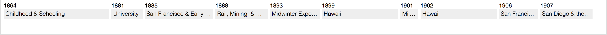

# Production build beta

(sketches branch)

## Configuration

We had some issues with very small labels being cut off into nothing. So Stephen added some configuration that allows for some tweaking of the widths of the label. You can pass in a float that represents something along the lines of:

> percentage of width that will be divided equally to all boxes in the timeline.

Real world example:

* Configuration value at: 50.0
* 10 items
* The minimum width of each one will be 5% of the width of the screen, plus the normal width relative to the amount of canvases/date

## Examples:

Set to 50%:

Set to 0% - exactly proportional:

Set to 100% (everything equal width):

