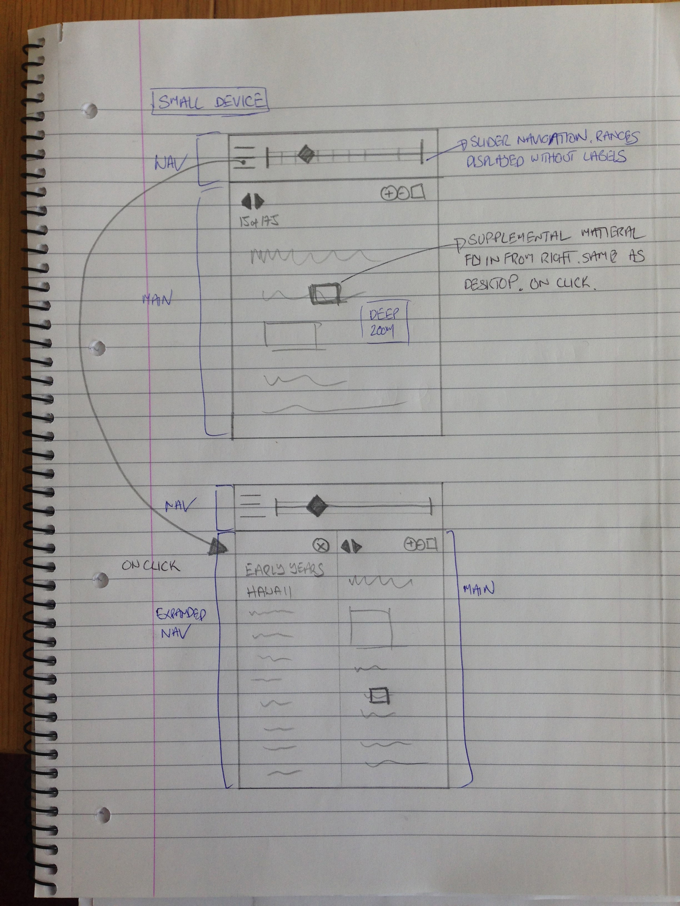

# User focus

(from Cillian)

We think the book is the main focus of the interaction. As such, the book should deep zoom and be full width. After some thought, supplemental material can open as an animated, slide-in-from-the-right full-screen overlay to display the supplemental content. We plan to use a “see also” link to the item in the digital repository, but don’t want to distract from the book by encouraging users to go to the repository for multiple pages and deep zoom. The jump may be too much for some users. How about the supplemental material is full width overlay, multiple page viewer, with deep zoom, and has link to see also and close the overlay.
 
For touch screen, I see the interaction been the same.
For smaller screens, I see the timeline/navigation turning into hamburger menu with the ranges being text links and the slider being visible from the start.

## Desktop / tablet:

## Small:

 
 